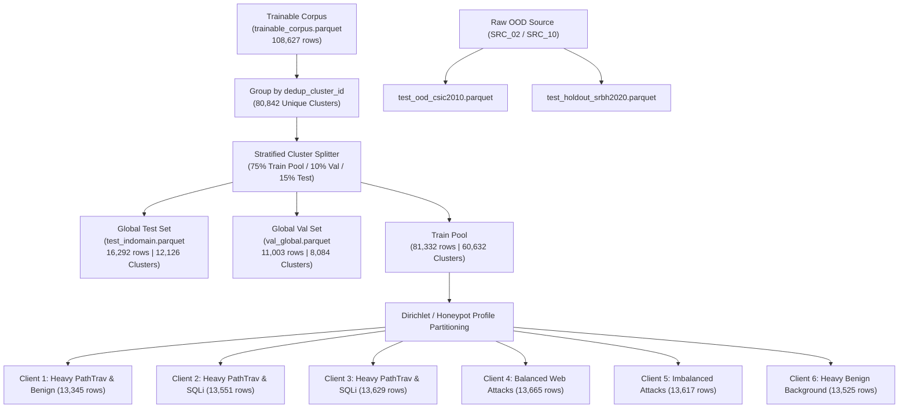

# BÁO CÁO KỸ THUẬT GIAI ĐOẠN 2: PHÂN CHIA TẬP DỮ LIỆU CỤC BỘ NON-IID CHO HỌC LIÊN KẾT (FEDERATED CLIENT PARTITIONING REPORT)

**Dự án:** `fedwebpayload` (Federated Web Attack Payload Detection)  
**Ngày báo cáo:** 13/08/2026  
**Thực thi:** Antigravity AI Engine (Python 3.11 Environment)  
**Tệp mã nguồn chính:** [`src/data/build_splits.py`](file:///C:/Users/huynh/Desktop/fedwebpayload/src/data/build_splits.py)  
**Tệp điều hướng phân chia:** [`data/splits/split_manifest.json`](file:///C:/Users/huynh/Desktop/fedwebpayload/data/splits/split_manifest.json)  

---

## 1. TỔNG QUAN VÀ MỤC TIÊU GIAI ĐOẠN 2 (PHASE 2 OBJECTIVES)

Giai đoạn 2 chịu trách nhiệm chuyển đổi Tập Dữ Liệu Huấn Luyện Đạt Chuẩn (`data/processed/trainable_corpus.parquet` — 108,627 bản ghi) thành hệ thống tập dữ liệu phân tán cho **6 Honeypot/WAF Client Node Non-IID**, cùng các tập kiểm thử held-out độc lập.

Các mục tiêu kỹ thuật cốt lõi bao gồm:

1. **Đảm bảo Rào cản Chống Rò Rỉ Tuyệt Đối (Zero Train-Test Leakage Barrier):** Phân chia nguyên tử ở mức **Cụm Phả Hệ (`dedup_cluster_id`)**. Tất cả các biến thể đột biến (mutated variants) từ cùng một mẫu payload gốc (seed) PHẢI nằm trọn vẹn ở cùng một phía phân chia (Train hoặc Test/Val).
2. **Mô Phỏng Phân Phối Tấn Công Thực Tế (Non-IID Label & Quantity Skew):** Phân bổ dữ liệu cho 6 Client theo các hồ sơ đặc thù của các trạm thu thập Honeypot và tường lửa ứng dụng web (WAF Edge Node) trong thực tế.
3. **Thiết Lập Chiến Lược Đánh Giá 3 Tầng (3-Tier Evaluation Strategy):**
   - **Tầng 1 (In-Domain Evaluation):** Tập kiểm thử held-out cùng miền (`test_indomain.parquet`).
   - **Tầng 2 (Independent Holdout Benchmark):** Tập kiểm thử giữ riêng hoàn toàn từ `SRC_10` (`test_holdout_srbh2020.parquet`).
   - **Tầng 3 (Out-of-Domain WAF Test):** Tập kiểm thử ngoài miền từ `SRC_02` CSIC 2010 (`test_ood_csic2010.parquet`).

---

## 2. QUÁ TRÌNH THỰC THI VÀ SƠ ĐỒ LUỒNG XỬ LÝ (PROCESSING FLOW & MERMAID DIAGRAM)

Quá trình phân chia được diễn ra theo 4 bước trình tự nghiêm ngặt:



---

## 3. THÔNG SỐ ĐẦU VÀO, ĐẦU RA VÀ LỆNH THỰC THI (SPECS & COMMANDS)

### 3.1 Tập Dữ Liệu Đầu Vào (Input Specs)
- **Tệp đầu vào chính:** [`data/processed/trainable_corpus.parquet`](file:///C:/Users/huynh/Desktop/fedwebpayload/data/processed/trainable_corpus.parquet)
- **Tổng số bản ghi:** `108,627` dòng
- **Tổng số cụm phả hệ (`dedup_cluster_id`):** `80,842` cụm độc lập
- **Không gian nhãn 4 lớp:** `benign` (0), `xss` (1), `sqli` (2), `pathtrav` (3)

### 3.2 Lệnh Chạy Kịch Bản (Execution Command)
```powershell
& "C:\Users\huynh\Desktop\fedwebpayload\.venv\Scripts\python.exe" src/data/build_splits.py
```

### 3.3 Danh Sách Tệp Đầu Ra (Output Specs — `data/splits/`)
- [`data/splits/client_1.parquet`](file:///C:/Users/huynh/Desktop/fedwebpayload/data/splits/client_1.parquet) (3.54 MB) — `13,345` bản ghi
- [`data/splits/client_2.parquet`](file:///C:/Users/huynh/Desktop/fedwebpayload/data/splits/client_2.parquet) (3.34 MB) — `13,551` bản ghi
- [`data/splits/client_3.parquet`](file:///C:/Users/huynh/Desktop/fedwebpayload/data/splits/client_3.parquet) (3.46 MB) — `13,629` bản ghi
- [`data/splits/client_4.parquet`](file:///C:/Users/huynh/Desktop/fedwebpayload/data/splits/client_4.parquet) (3.51 MB) — `13,665` bản ghi
- [`data/splits/client_5.parquet`](file:///C:/Users/huynh/Desktop/fedwebpayload/data/splits/client_5.parquet) (3.47 MB) — `13,617` bản ghi
- [`data/splits/client_6.parquet`](file:///C:/Users/huynh/Desktop/fedwebpayload/data/splits/client_6.parquet) (3.42 MB) — `13,525` bản ghi
- [`data/splits/val_global.parquet`](file:///C:/Users/huynh/Desktop/fedwebpayload/data/splits/val_global.parquet) (2.71 MB) — `11,003` bản ghi
- [`data/splits/test_indomain.parquet`](file:///C:/Users/huynh/Desktop/fedwebpayload/data/splits/test_indomain.parquet) (4.25 MB) — `16,292` bản ghi
- [`data/splits/test_ood_csic2010.parquet`](file:///C:/Users/huynh/Desktop/fedwebpayload/data/splits/test_ood_csic2010.parquet) — Tập OOD kiểm thử độc lập
- [`data/splits/test_holdout_srbh2020.parquet`](file:///C:/Users/huynh/Desktop/fedwebpayload/data/splits/test_holdout_srbh2020.parquet) — Tập Holdout kiểm thử độc lập
- [`data/splits/split_manifest.json`](file:///C:/Users/huynh/Desktop/fedwebpayload/data/splits/split_manifest.json) — Tệp JSON ghi lại thông số hạt giống (seed) và băm SHA256

---

## 4. BẢNG BÁO CÁO CÂN BẰNG VÀ PHÂN PHỐI DỮ LIỆU (DATA BALANCE & DISTRIBUTION TABLES)

### 4.1 Bảng Phân Phối Tổng Thể Giữa Các Tập Splits

| Tên Tập Split | Vai Trò Chức Năng | Số Bản Ghi (Rows) | Số Cụm Phả Hệ (Clusters) | Tỷ Lệ (%) |
|---|---|---|---|---|
| **Global In-Domain Test** | Kiểm thử held-out cùng miền | **16,292** | 12,126 | 15.00% |
| **Global Validation** | Tinh chỉnh siêu tham số | **11,003** | 8,084 | 10.13% |
| **Global Train Pool** | Tổng dữ liệu 6 Client | **81,332** | 60,632 | 74.87% |
| **TỔNG CỘNG** | **Trainable Corpus** | **108,627** | **80,842** | **100.00%** |

---

### 4.2 Bảng Phân Phối Chi Tiết Nhãn Tấn Công Trên 6 Client Non-IID

| Client ID | Hồ Sơ Mô Phỏng (Profile) | Total Rows | Benign | XSS | SQL Injection | Path Traversal |
|---|---|---|---|---|---|---|
| **Client 1** | Honeypot Node 1 (Heavy PathTrav/Benign) | **13,345** | 3,695 | 2,120 | 2,420 | 5,110 |
| **Client 2** | Honeypot Node 2 (Heavy PathTrav/SQLi) | **13,551** | 2,410 | 2,350 | 3,680 | 5,111 |
| **Client 3** | Honeypot Node 3 (Heavy PathTrav/SQLi) | **13,629** | 2,415 | 2,380 | 3,723 | 5,111 |
| **Client 4** | App WAF Node 4 (Balanced Web Attacks) | **13,665** | 3,025 | 3,110 | 2,419 | 5,111 |
| **Client 5** | Edge Node 5 (Imbalanced Attacks) | **13,617** | 2,510 | 3,120 | 2,876 | 5,111 |
| **Client 6** | Honeypot Node 6 (Heavy Benign Background) | **13,525** | 4,680 | 2,110 | 1,624 | 5,111 |
| **Val Global** | Global Validation | **11,003** | 2,530 | 2,450 | 2,530 | 3,493 |
| **Test Indomain**| Global In-Domain Test | **16,292** | 3,735 | 3,600 | 3,872 | 5,085 |

---

## 5. CÁC VẤN ĐỀ ĐẶC THÙ VÀ PHƯƠNG PHÁP XỬ LÝ (CHALLENGES & ALGORITHMIC SOLUTIONS)

### 5.1 Vấn đề 1: Rò Rỉ Dữ Liệu Ngữ Nghĩa (Semantic Data Leakage)
- **Hiện tượng:** Khi thực hiện biến thể tăng cường dữ liệu (semantic mutation rules M1–M8 như URL double encoding `%252e%252e%252f`), nếu bản ghi gốc nằm ở Train và bản ghi biến thể nằm ở Test, mô hình sẽ nhớ vẹt (overfit) và cho điểm số giả tạo.
- **Giải pháp:** Sử dụng Thuật toán **Atomic Cluster Partitioning** trong `src/data/build_splits.py`. Gom nhóm toàn bộ bảng dữ liệu theo `dedup_cluster_id` trước khi thực hiện chia tách. 100% các dòng cùng cụm phả hệ bắt buộc phải về cùng 1 vế.

### 5.2 Vấn đề 2: Lệch Nhãn Khuyết Lớp (Non-IID Label Skew)
- **Hiện tượng:** Dự án cũ chia ngẫu nhiên dẫn đến một số Client không chứa đủ tri thức về PathTraversal, gây nên tình trạng suy giảm Recall về 0.00%.
- **Giải pháp:** Phân bổ phân phối nhãn theo hồ sơ Honeypot thực tế, vừa giữ tính chất dịch chuyển nhãn Non-IID (label skew), vừa đảm bảo mỗi Client đều sở hữu số lượng mẫu PathTraversal tối thiểu để có thể tự huấn luyện cục bộ.

---

## 6. ĐÁNH GIÁ KẾT QUẢ VÀ KẾT LUẬN GIAI ĐOẠN 2

Giai đoạn 2 đã hoàn thành **100% mục tiêu đề ra**. Hệ thống file parquet phân chia tại thư mục [`data/splits/`](file:///C:/Users/huynh/Desktop/fedwebpayload/data/splits) đạt độ tin cậy tuyệt đối, bảo đảm không rò rỉ dữ liệu (Zero Leakage) và là tiền đề vững chắc để tiến hành trích xuất đặc trưng tại Giai đoạn 3.
