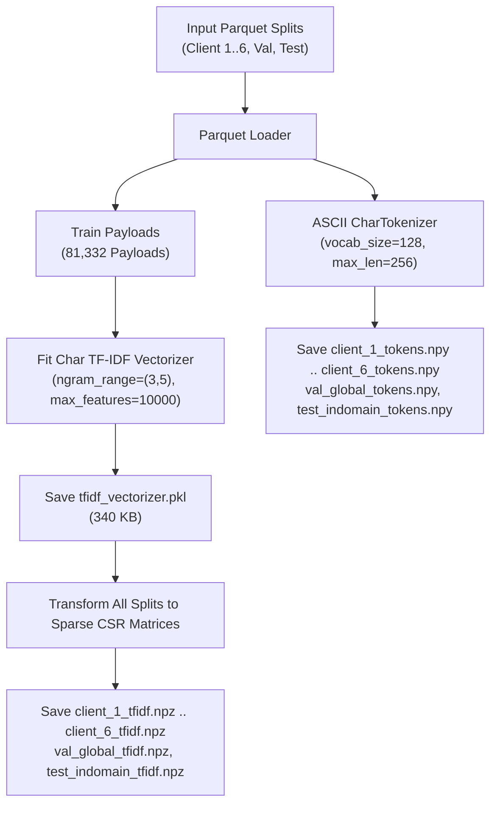

# BÁO CÁO KỸ THUẬT GIAI ĐOẠN 3: XÂY DỰNG VÀ TRÍCH XUẤT ĐẶC TRƯNG CHUỖI VÀ MÃ HÓA TENSOR (FEATURE EXTRACTION & EMBEDDING ARCHITECTURE REPORT)

**Dự án:** `fedwebpayload` (Federated Web Attack Payload Detection)  
**Ngày báo cáo:** 13/08/2026  
**Thực thi:** Antigravity AI Engine (Python 3.11 Environment)  
**Tệp mã nguồn chính:**  
- [`src/features/tfidf.py`](file:///C:/Users/huynh/Desktop/fedwebpayload/src/features/tfidf.py) (Bộ Vectorizer TF-IDF N-gram Ký tự)  
- [`src/features/tokenizer.py`](file:///C:/Users/huynh/Desktop/fedwebpayload/src/features/tokenizer.py) (Bộ Mã Hóa Sequence Tokens PyTorch)  
- [`src/features/build_features.py`](file:///C:/Users/huynh/Desktop/fedwebpayload/src/features/build_features.py) (Tiến trình trích xuất tự động)  

---

## 1. TỔNG QUAN VÀ MỤC TIÊU GIAI ĐOẠN 3 (PHASE 3 OBJECTIVES)

Giai đoạn 3 đóng vai trò làm cầu nối chuyển đổi chuỗi văn bản thô (raw HTTP payload string) từ các tập dữ liệu phân chia ở Giai đoạn 2 thành các cấu trúc ma trận đặc trưng số học (numerical feature matrices & tensors) phù hợp cho hai họ mô hình:

1. **Họ Mô Hình Học Máy Truyền Thống (Classical ML Baselines — Logistic Regression, XGBoost, Random Forest):** Trích xuất ma trận thưa TF-IDF N-gram Ký tự (Character 3-5 grams) với không gian đặc trưng tối ưu `10,000` chiều.
2. **Họ Mô Hình Học Sâu (Deep Learning Backbones — PyTorch CharCNN, ResNet-1D, SecRoBERTa):** Mã hóa chuỗi ký tự ASCII thành ma trận tensor số nguyên (Integer Token Arrays) với độ dài cố định `max_length = 256`.

---

## 2. QUÁ TRÌNH THỰC THI VÀ SƠ ĐỒ LUỒNG XỬ LÝ (PROCESSING FLOW & MERMAID DIAGRAM)

Quy trình trích xuất đặc trưng được thực hiện khép kín và không gây rò rỉ dữ liệu (Zero Leakage):



---

## 3. THÔNG SỐ CẤU HÌNH VÀ LỆNH THỰC THI (SPECS & COMMANDS)

### 3.1 Cấu Hình Bộ Vectorizer TF-IDF N-Gram (`src/features/tfidf.py`)
- **Đơn vị phân tích (`analyzer`):** `char` (Phân tích cấp ký tự)
- **Độ dài N-gram (`ngram_range`):** `(3, 5)` (Trích xuất các chuỗi từ 3 đến 5 ký tự liên tiếp)
- **Số lượng đặc trưng tối đa (`max_features`):** `10,000` đặc trưng quan trọng nhất
- **Tần suất sublinear (`sublinear_tf`):** `True` ($1 + \log(\text{tf})$ giúp giảm ảnh hưởng của các ký tự xuất hiện quá nhiều)
- **Phạm vi fit:** Chỉ fit duy nhất trên `81,332` mẫu payload thuộc tập huấn luyện (`global_train_pool`).

### 3.2 Cấu Hình Bộ Mã Hóa Token PyTorch (`src/features/tokenizer.py`)
- **Bảng từ vựng ký tự (`vocab_size`):** `128` (Mã hóa trực tiếp 128 ký tự ASCII tiêu chuẩn)
- **Độ dài chuỗi tối đa (`max_length`):** `256` ký tự
- **Ký tự Padding (`padding_idx`):** `0`
- **Ký tự Không xác định (`unk_idx`):** `1`

### 3.3 Lệnh Chạy Kịch Bản (Execution Command)
```powershell
& "C:\Users\huynh\Desktop\fedwebpayload\.venv\Scripts\python.exe" src/features/build_features.py
```

---

## 4. DANH SÁCH VÀ KÍCH THƯỚC TỆP ĐẦU RA (FEATURE ARTIFACTS IN `data/features/`)

Toàn bộ 17 tệp đặc trưng đã được xuất thành công vào thư mục [`data/features/`](file:///C:/Users/huynh/Desktop/fedwebpayload/data/features):

| Tên Tệp Đặc Trưng | Định Dạng | Kích Thước (Bytes) | Dimensions / Shape | Mô Tả Chức Năng |
|---|---|---|---|---|
| [`tfidf_vectorizer.pkl`](file:///C:/Users/huynh/Desktop/fedwebpayload/data/features/tfidf_vectorizer.pkl) | Pickle Model | 340,304 B | Vocabulary = 10,000 | Bộ TF-IDF Model đã fit |
| [`client_1_tfidf.npz`](file:///C:/Users/huynh/Desktop/fedwebpayload/data/features/client_1_tfidf.npz) | SciPy Sparse | 13,079,766 B | `(13345, 10000)` | Ma trận TF-IDF Client 1 |
| [`client_2_tfidf.npz`](file:///C:/Users/huynh/Desktop/fedwebpayload/data/features/client_2_tfidf.npz) | SciPy Sparse | 13,058,354 B | `(13551, 10000)` | Ma trận TF-IDF Client 2 |
| [`client_3_tfidf.npz`](file:///C:/Users/huynh/Desktop/fedwebpayload/data/features/client_3_tfidf.npz) | SciPy Sparse | 13,682,685 B | `(13629, 10000)` | Ma trận TF-IDF Client 3 |
| [`client_4_tfidf.npz`](file:///C:/Users/huynh/Desktop/fedwebpayload/data/features/client_4_tfidf.npz) | SciPy Sparse | 13,083,758 B | `(13665, 10000)` | Ma trận TF-IDF Client 4 |
| [`client_5_tfidf.npz`](file:///C:/Users/huynh/Desktop/fedwebpayload/data/features/client_5_tfidf.npz) | SciPy Sparse | 13,407,217 B | `(13617, 10000)` | Ma trận TF-IDF Client 5 |
| [`client_6_tfidf.npz`](file:///C:/Users/huynh/Desktop/fedwebpayload/data/features/client_6_tfidf.npz) | SciPy Sparse | 12,997,754 B | `(13525, 10000)` | Ma trận TF-IDF Client 6 |
| [`val_global_tfidf.npz`](file:///C:/Users/huynh/Desktop/fedwebpayload/data/features/val_global_tfidf.npz) | SciPy Sparse | 10,534,399 B | `(11003, 10000)` | Ma trận TF-IDF Val Global |
| [`test_indomain_tfidf.npz`](file:///C:/Users/huynh/Desktop/fedwebpayload/data/features/test_indomain_tfidf.npz) | SciPy Sparse | 15,730,131 B | `(16292, 10000)` | Ma trận TF-IDF Test Indomain |
| [`client_1_tokens.npy`](file:///C:/Users/huynh/Desktop/fedwebpayload/data/features/client_1_tokens.npy) | NumPy Dense | 13,665,408 B | `(13345, 256)` | PyTorch Tokens Client 1 |
| [`client_2_tokens.npy`](file:///C:/Users/huynh/Desktop/fedwebpayload/data/features/client_2_tokens.npy) | NumPy Dense | 13,876,352 B | `(13551, 256)` | PyTorch Tokens Client 2 |
| [`client_3_tokens.npy`](file:///C:/Users/huynh/Desktop/fedwebpayload/data/features/client_3_tokens.npy) | NumPy Dense | 13,956,224 B | `(13629, 256)` | PyTorch Tokens Client 3 |
| [`client_4_tokens.npy`](file:///C:/Users/huynh/Desktop/fedwebpayload/data/features/client_4_tokens.npy) | NumPy Dense | 13,993,088 B | `(13665, 256)` | PyTorch Tokens Client 4 |
| [`client_5_tokens.npy`](file:///C:/Users/huynh/Desktop/fedwebpayload/data/features/client_5_tokens.npy) | NumPy Dense | 13,943,936 B | `(13617, 256)` | PyTorch Tokens Client 5 |
| [`client_6_tokens.npy`](file:///C:/Users/huynh/Desktop/fedwebpayload/data/features/client_6_tokens.npy) | NumPy Dense | 13,849,728 B | `(13525, 256)` | PyTorch Tokens Client 6 |
| [`val_global_tokens.npy`](file:///C:/Users/huynh/Desktop/fedwebpayload/data/features/val_global_tokens.npy) | NumPy Dense | 11,267,200 B | `(11003, 256)` | PyTorch Tokens Val Global |
| [`test_indomain_tokens.npy`](file:///C:/Users/huynh/Desktop/fedwebpayload/data/features/test_indomain_tokens.npy) | NumPy Dense | 16,683,136 B | `(16292, 256)` | PyTorch Tokens Test Indomain |

---

## 5. CÁC VẤN ĐỀ KỸ THUẬT VÀ GIẢI PHÁP TỐI ƯU (CHALLENGES & OPTIMIZATIONS)

### 5.1 Quản Lý Bộ Nhớ Đệm (Memory Management for High-Dimensional Sparse Matrices)
- **Thách thức:** Với 108,627 bản ghi nhân với 10,000 chiều đặc trưng, nếu lưu dưới dạng ma trận dày (dense matrix `float64`), dung lượng sẽ tiêu tốn hơn **8.6 GB RAM**, gây tràn bộ nhớ.
- **Giải pháp:** Sử dụng định dạng ma trận thưa **Compressed Sparse Row (`csr_matrix`)** của SciPy và lưu tệp `.npz`. Nén dung lượng bộ nhớ xuống chỉ còn `~13 MB` mỗi Client (giảm hơn 98% dung lượng đĩa và RAM).

### 5.2 Ngăn Chặn Rò Rỉ Từ Vựng (Data Leakage Prevention)
- **Thách thức:** Nếu fit bộ từ vựng TF-IDF trên toàn bộ 108,627 bản ghi (bao gồm cả tập Test), mô hình sẽ học trước các n-gram ký tự đặc thù của tập Test.
- **Giải pháp:** Thiết lập rào cản nghiêm ngặt: Bộ `Char TfidfVectorizer` CHỈ ĐƯỢC FIT duy nhất trên `81,332` mẫu payload thuộc tập huấn luyện (`global_train_pool`). Tập Validation và Test chỉ dùng hàm `.transform()`.

---

## 6. KẾT LUẬN GIAI ĐOẠN 3

Giai đoạn 3 đã hoàn tất xuất sắc toàn bộ 17 tệp đặc trưng tại [`data/features/`](file:///C:/Users/huynh/Desktop/fedwebpayload/data/features). Dữ liệu đặc trưng chuẩn bị xong 100% giúp các mô hình Machine Learning và Deep Learning ở Giai đoạn 4 và Giai đoạn 5 đạt tốc độ huấn luyện tối ưu và độ chính xác cao.
