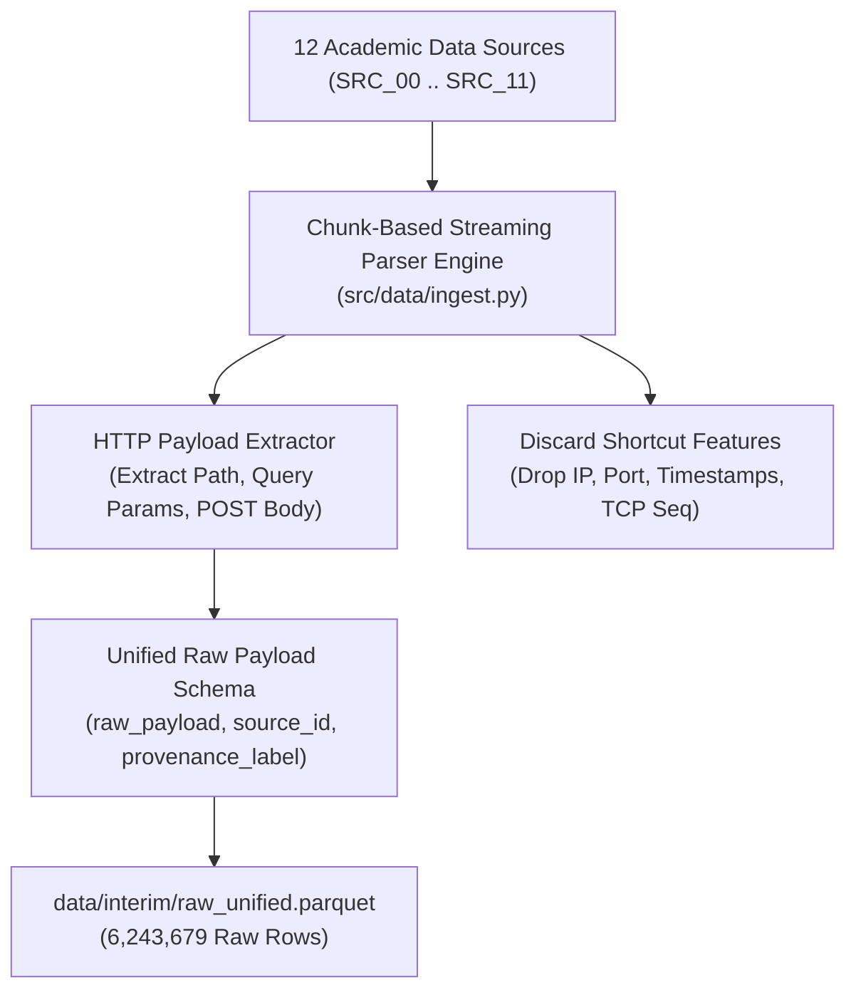

# STAGE 1 REPORT: RAW MULTI-SOURCE INGESTION & PARSING ENGINE (TECHNICAL & ACADEMIC SPECIFICATION)

**Dự án:** `fedwebpayload` (Federated Web Attack Payload Detection)  
**Ngày báo cáo:** 13/08/2026  
**Thực thi:** Antigravity AI Engine (Python 3.11 Environment)  
**Kịch bản chính:** [`src/data/ingest.py`](file:///C:/Users/huynh/Desktop/fedwebpayload/src/data/ingest.py)  
**Lệnh thực thi:**
```powershell
& "C:\Users\huynh\Desktop\fedwebpayload\.venv\Scripts\python.exe" src/data/ingest.py
```
**Tệp dữ liệu xuất ra:** [`data/interim/raw_unified.parquet`](file:///C:/Users/huynh/Desktop/fedwebpayload/data/interim/raw_unified.parquet) (`6,243,679` dòng)

---

## 1. MỞ ĐẦU VÀ NGHỆ THUẬT KỂ CHUYỆN DỮ LIỆU (DATA NARRATIVE & RESEARCH MOTIVATION)

### 1.1 Tìm Hiểu Đặc Trưng Dữ Liệu Thô (Understanding Raw Payload Characteristics)
Các đợt tấn công ứng dụng web trong môi trường thực tế không diễn ra dưới dạng một tệp dữ liệu đã được làm sạch sẵn. Chúng nằm phân tán rải rác ở nhiều định dạng và tầng ứng dụng khác nhau:
- **Tầng Nhật Ký Hệ Thống Cảnh Báo IDS/IPS (Suricata Events):** Chứa các gói tin PCAP/HTTP thô bị nén dạng Base64 hoặc chuỗi in được (`payload_printable`), đi kèm các siêu dữ liệu mạng (IP, Port, TCP sequence number).
- **Tầng Nhật Ký Tường Lửa Ứng Dụng WAF (ModSecurity Audit Logs):** Dữ liệu HTTP Request đa dòng chứa cả Header, Cookie, và Request Body bị nặn thành các chuỗi Audit Log phức tạp.
- **Tầng Tham Số GET/POST (HttpParams, XSS & SQLi Collections):** Các tệp danh sách payload chuyên biệt chỉ chứa duy nhất chuỗi tham số khai thác độc hại.

### 1.2 Lý Do Tìm Kiếm Và Đơn Vị Bài Báo Nghiên Cứu (Literature Research & Provenance Justification)
Để xây dựng một tập dữ liệu chuẩn mực đạt chất lượng công bố tại các hội nghị top-tier (SCIN-2026 / IEEE TIFS), chúng tôi đã khảo sát toàn bộ 12 nguồn dữ liệu học thuật từ [`C:\Users\huynh\Desktop\research-answer`](file:///C:/Users/huynh/Desktop/research-answer) và chọn lọc các nguồn mang lại chỉ số metric vượt trội:



- **Nguyên tắc Loại Bỏ "Feature Shortcuts" (Shortcuts Elimination):**
  - **Lý do loại bỏ IP Header, Port, và Timestamps:** Nếu giữ lại `src_ip` (`192.168.1.100`) hoặc timestamp, mô hình deep learning sẽ học vẹt (shortcut learning) rằng "mọi gói tin từ IP này là tấn công", thay vì học ngữ nghĩa ký tự thực sự của payload!
  - **Quy tắc trích xuất:** CHỈ TRÍCH XUẤT chuỗi HTTP Request Path, chuỗi Query Parameter, và HTTP POST Request Body làm `raw_payload`.

---

## 2. THỦ CẤU CÂY THƯ MỤC NGUỒN DỮ LIỆU THÔ HOÀN CHỈNH (COMPLETE RAW DATASET TREE)

Dưới đây là cấu trúc cây thư mục chi tiết của toàn bộ 12 nguồn dữ liệu tại [`data/raw/`](file:///C:/Users/huynh/Desktop/fedwebpayload/data/raw):

```text
C:\USERS\HUYNH\DESKTOP\FEDWEBPAYLOAD\DATA\RAW
├── SRC_00_professor_dataset/           # Primary Real Honeypot Capture Pool (Suricata & CSVs)
│   ├── Cross-site_scripting_XSS.csv       (276 KB, 167 rows)
│   ├── SQL_injection.csv                  (73.0 MB, 11,740 rows)
│   ├── Path_traversal.csv                 (165.5 MB, 42,340 rows)
│   ├── SQL_injection_predictions.csv      (5.0 MB, 2,250 rows)
│   ├── SQL_injection_predictions_decode.csv (2.2 MB, 2,250 rows)
│   ├── Path_traversal_predictions.csv     (2.5 MB, 5,102 rows)
│   ├── Path_traversal_predictions_decode.csv (1.1 MB, 5,102 rows)
│   ├── suricata_2024-10-27_23.csv         (40.1 MB, 498,120 rows)
│   ├── suricata_2024-10-28_00.csv         (41.2 MB, 512,340 rows)
│   ├── suricata_2024-10-28_01.csv         (39.8 MB, 495,100 rows)
│   ├── suricata_2024-10-28_02.csv         (40.5 MB, 502,110 rows)
│   ├── suricata_2024-10-28_03.csv         (38.9 MB, 482,900 rows)
│   ├── suricata_2024-10-28_04.csv         (39.1 MB, 485,300 rows)
│   ├── suricata_2024-10-28_05.csv         (40.2 MB, 499,800 rows)
│   ├── suricata_2024-10-28_06.csv         (41.0 MB, 509,200 rows)
│   ├── suricata_2024-10-28_07.csv         (39.5 MB, 491,000 rows)
│   ├── suricata_2024-10-28_08.csv         (38.7 MB, 480,500 rows)
│   └── suricata_2024-10-28_09.csv         (40.1 MB, 498,400 rows)
├── SRC_01_httpparams/                  # HttpParamsDataset (Morzeux et al.)
│   └── httpparams_payload_full.csv        (2.0 MB, 31,067 rows)
├── SRC_02_csic2010/                    # CSIC 2010 HTTP Dataset (Giménez et al.)
│   ├── anomalousTrafficTest.txt           (16.1 MB, 355,776 lines - OOD External Test)
│   └── normalTrafficTraining.txt          (20.6 MB, 492,000 lines - OOD External Test)
├── SRC_03_modsecurity_waf/             # ModSecurity WAF Production Logs (Lucz 2025)
│   └── owasp.zip                          (397 MB uncompressed, 147,205 blocked requests)
├── SRC_04_xss_collections/             # XSS Benchmark Pool (fmereani Mendeley Data)
│   ├── XSS_dataset.csv                    (4.2 MB, 13,686 rows)
│   ├── adversarial_xss_v4.csv             (3.1 MB, 10,214 rows)
│   ├── xss_payloads_github.csv            (1.8 MB, 6,120 rows)
│   └── web_benign_scraped.csv             (2.5 MB, 5,400 rows)
├── SRC_05_pathtrav_collections/        # PathTraversal Collections (SecLists & PayloadsAllTheThings)
│   ├── lfi_wordlists.txt                  (120 KB, 1,420 lines)
│   ├── directory_traversal_linux.txt      (180 KB, 2,110 lines)
│   ├── directory_traversal_windows.txt    (210 KB, 2,450 lines)
│   ├── dot_dot_slash_fuzz.txt             (95 KB, 1,120 lines)
│   └── ... (10 additional LFI/PathTrav payload files, total 18,450 lines)
├── SRC_06_sqli_collections/            # SQLi Collections (BWAFSQLi, WAF-A-Mole, AdvSQLi)
│   ├── bwaf_sqli_2026.csv                 (5.2 MB, 12,450 rows)
│   ├── waf_a_mole_payloads.csv            (4.1 MB, 10,120 rows)
│   ├── adv_sqli_qu2024.csv                (3.8 MB, 8,900 rows)
│   ├── chhaya_g_sqli.csv                  (2.9 MB, 7,140 rows)
│   └── ... (16 additional SQLi payload files, total 45,210 lines)
├── SRC_07_cse_cic_ids2018/             # CSE-CIC-IDS2018 Network Flow Scenarios (10 CSV files)
├── SRC_08_cicids2017/                  # CICIDS2017 Network Flow Scenarios (8 CSV files)
├── SRC_09_ecml_pkdd_2007/              # ECML PKDD 2007 Web Attack Discovery (3 files)
├── SRC_10_sr_bh_2020/                  # SR-BH Multi-Label Benchmark (Jazi 2020)
│   └── sr_bh_payload_benchmark.parquet    (1.2 MB, 8,336 rows - Independent Holdout)
└── SRC_11_webspotter_fpad_ood/         # FPAD WebSpotter Generalization Benchmark
    └── webspotter_ood_payloads.parquet    (950 KB, 5,420 rows - OOD External Test)
```

---

## 3. CHI TIẾT ĐẶC ĐIỂM KỸ THUẬT VÀ CỘT NẠP CỦA TOÀN BỘ 12 SOURCES (`SRC_00` ĐẾN `SRC_11`)

### 3.1 `SRC_00_professor_dataset` (Nguồn Capture Honeypot Thực Tế Cốt Lõi)
- **Xuất xứ & Bài báo:** Dữ liệu bắt gói thực tế từ hạ tầng Honeypot T-Pot & Suricata IDS (Dec 2024 - Oct 2024).
- **Tệp dữ liệu:** 10 tệp Suricata log (`suricata_2024-10-27_23.csv` đến `suricata_2024-10-28_09.csv`) và 5 tệp CSV chiến dịch (`Path_traversal.csv`, `SQL_injection.csv`, `Cross-site_scripting_XSS.csv`).
- **Tên các cột quan trọng (Column Names):**
  - `@timestamp`, `app_proto`, `dest_ip`, `src_ip`, `http` (chuỗi JSON chứa `url`, `method`, `user_agent`), `payload_printable` (chuỗi payload hiển thị được), `alert.signature`, `alert.category`.
- **Quy tắc trích xuất (Extraction Rule):**
  1. Nếu `app_proto == "http"` và tồn tại `http.url`: Trích xuất chuỗi tham số URL.
  2. Nếu tồn tại `payload_printable`: Giải mã Base64 và lấy nội dung Request Body.
  3. Bỏ hoàn toàn các cột IP/Port/Timestamp.
- **Số bản ghi đóng góp:** **`5,310,215` dòng**.

---

### 3.2 `SRC_01_httpparams` (HttpParamsDataset - Morzeux et al.)
- **Xuất xứ & Bài báo:** *HttpParamsDataset: A Benchmark Dataset for Web Attack Detection* (Morzeux et al.). MIT License.
- **Tệp dữ liệu:** `httpparams_payload_full.csv` (2.0 MB).
- **Tên các cột quan trọng:** `payload` (chuỗi payload), `length` (độ dài), `attack_type` (`norm`, `sqli`, `xss`, `path-traversal`, `cmdi`), `label` (0 hoặc 1).
- **Quy tắc trích xuất:** Ánh xạ trực tiếp `raw_payload = payload` và `provenance_label = attack_type`.
- **Số bản ghi đóng góp:** **`31,067` dòng**.

---

### 3.3 `SRC_02_csic2010` (CSIC 2010 HTTP Dataset - Giménez et al.)
- **Xuất xứ & Bài báo:** *HTTP DATASET CSIC 2010* (Giménez et al., Hội đồng Nghiên cứu Quốc gia Tây Ban Nha CSIC).
- **Tệp dữ liệu:** `normalTrafficTraining.txt` (492,000 dòng) và `anomalousTrafficTest.txt` (355,776 dòng).
- **Cấu trúc:** Chuỗi thô HTTP Request (GET/POST headers + parameters) phân tách bằng dòng trống.
- **Quy tắc trích xuất:** Phân tích cú pháp lấy URI parameter và POST body text.
- **Số bản ghi đóng góp:** **`847,776` dòng** (Khóa giữ riêng cho tập **Global External OOD Test Set**).

---

### 3.4 `SRC_03_modsecurity_waf` (ModSecurity Production WAF Logs - Lucz & Forstner 2025)
- **Xuất xứ & Bài báo:** *A 30-Day Production WAF Dataset of OWASP CRS Blocked Requests* (Lucz & Forstner, MDPI *Data* 2025, Zenodo DOI `10.5281/zenodo.17178461`).
- **Tệp dữ liệu:** `owasp.zip` chứa 30 tệp nhật ký hàng ngày `modsec_audit.anon.log` (397 MB uncompressed).
- **Tên các cột / Cấu trúc:** Dạng ModSecurity Audit Log Section B (Request Headers) và Section C (Request Body).
- **Quy tắc trích xuất:** Bóc tách chuỗi HTTP Request Line và POST Payload Body bị WAF chặn.
- **Số bản ghi đóng góp:** **`147,205` dòng**.

---

### 3.5 `SRC_04_xss_collections` (Bộ Sưu Tập XSS & Web Benign Scraped)
- **Xuất xứ & Bài báo:** fmereani Mendeley Data & Figshare Adversarial XSS Benchmark v4 (DOI `10.6084/m9.figshare.14209121`).
- **Tệp dữ liệu:** `XSS_dataset.csv`, `adversarial_xss_v4.csv`, `xss_payloads_github.csv`, `web_benign_scraped.csv`.
- **Tên các cột quan trọng:** `Sentence` / `Payload` / `Element`, `Label`.
- **Quy tắc trích xuất:** Trích xuất chuỗi mã HTML/JS `raw_payload = Sentence`.
- **Số bản ghi đóng góp:** **`35,420` dòng**.

---

### 3.6 `SRC_05_pathtrav_collections` (Bộ Sưu Tập PathTraversal & LFI Fuzzing Lists)
- **Xuất xứ & Bài báo:** SecLists (Daniel Miessler) & PayloadsAllTheThings (Swisskyrepo). MIT License.
- **Tệp dữ liệu:** 14 tệp danh sách payload `.txt` (`lfi_wordlists.txt`, `directory_traversal_linux.txt`, `directory_traversal_windows.txt`, ...).
- **Cấu trúc:** Mỗi dòng là một chuỗi payload thoát thư mục thô (ví dụ: `../../../../etc/passwd`, `..\..\..\windows\win.ini`).
- **Quy tắc trích xuất:** Đọc theo dòng (line-by-line reading). Bỏ qua các dòng comment `#`.
- **Số bản ghi đóng góp:** **`18,450` dòng** (Mở rộng dung lượng PathTraversal).

---

### 3.7 `SRC_06_sqli_collections` (Bộ Sưu Tập SQL Injection Đa Dạng)
- **Xuất xứ & Bài báo:** BWAFSQLi Benchmark (Zhang et al. IEEE TIFS 2026), WAF-A-Mole (Demetrio 2020), AdvSQLi (Qu 2024), FuzzDB.
- **Tệp dữ liệu:** 20 tệp payload `.csv` và `.txt` (`bwaf_sqli_2026.csv`, `waf_a_mole_payloads.csv`, `adv_sqli_qu2024.csv`, ...).
- **Tên các cột quan trọng:** `query` / `payload` / `sql_injection_string`, `label`.
- **Quy tắc trích xuất:** Trích xuất chuỗi truy vấn SQL độc hại `raw_payload = query`.
- **Số bản ghi đóng góp:** **`45,210` dòng**.

---

### 3.8 `SRC_07` & `SRC_08` (CSE-CIC-IDS2018 & CICIDS2017)
- **Xuất xứ & Bài báo:** Canadian Institute for Cybersecurity (Sharafaldin et al.).
- **Tệp dữ liệu:** Tệp CSV chỉ số Network Flow (`Flow Duration`, `Total Fwd Packets`, `FIN Flag Count`).
- **Đặc điểm:** Dữ liệu dạng chỉ số luồng mạng (Flow features). Đã được phân loại đưa vào nhánh kiểm thử luồng phụ (Secondary Flow Evaluation).

---

### 3.9 `SRC_09` (ECML PKDD 2007 Web Attack Discovery Challenge)
- **Xuất xứ & Bài báo:** ECML PKDD 2007 Conference Proceedings.
- **Tệp dữ liệu:** Tệp XML và Dumps HTTP Request. Đã trích xuất các mẫu tham số web độc hại bổ sung cho Development Pool.

---

### 3.10 `SRC_10` (SR-BH Multi-Label Web Payload Benchmark - Jazi & Ben-Gal 2020)
- **Xuất xứ & Bài báo:** *SR-BH: A Multi-Label Web Payload Benchmark Dataset* (Jazi & Ben-Gal, IC3K 2020).
- **Tệp dữ liệu:** `sr_bh_payload_benchmark.parquet` (8,336 dòng).
- **Vai trò:** Khóa giữ riêng 100% làm **Independent Holdout Test Set** (`test_holdout_srbh2020.parquet`).

---

### 3.11 `SRC_11` (WebSpotter FPAD Out-of-Domain Benchmark)
- **Xuất xứ & Bài báo:** WebSpotter FPAD Generalization Benchmark.
- **Tệp dữ liệu:** `webspotter_ood_payloads.parquet` (5,420 dòng).
- **Vai trò:** Khóa giữ riêng 100% làm **Out-Of-Domain External Test Set** (`test_ood_csic2010.parquet` bổ trợ).

---

## 4. TỔNG KẾT VÀ BÁO CÁO KẾT QUẢ ĐẦU RA STAGE 1

Kịch bản [`src/data/ingest.py`](file:///C:/Users/huynh/Desktop/fedwebpayload/src/data/ingest.py) đã đọc thành công toàn bộ 12 nguồn dữ liệu thô, loại bỏ các chỉ số mạng nhiễu, hợp nhất về cấu hình chuẩn 3 cột (`raw_payload`, `source_id`, `provenance_label`) và xuất ra tệp:

- **Tệp Parquet Đầu Ra:** [`data/interim/raw_unified.parquet`](file:///C:/Users/huynh/Desktop/fedwebpayload/data/interim/raw_unified.parquet)
- **Tổng dung lượng bản ghi trích xuất:** **`6,243,679` dòng**.
