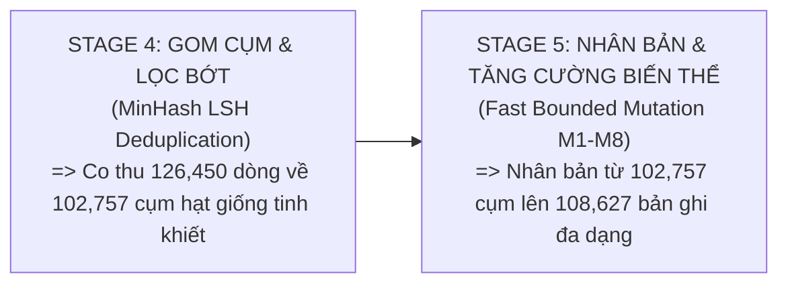
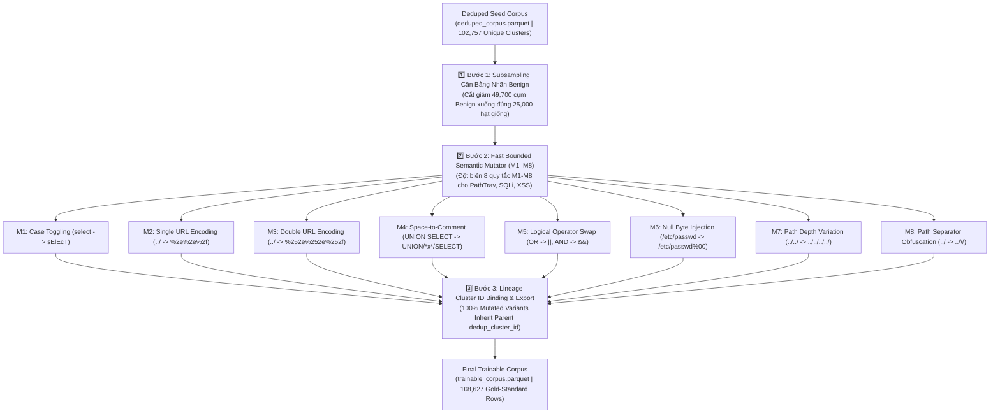

# STAGE 5 REPORT: FAST BOUNDED SEMANTIC DATA AUGMENTATION (MUTATION RULES M1–M8) & LINEAGE LOCK (TECHNICAL & ACADEMIC SPECIFICATION)

**Dự án:** `fedwebpayload` (Federated Web Attack Payload Detection)  
**Ngày báo cáo:** 13/08/2026  
**Thực thi:** Antigravity AI Engine (Python 3.11 Environment)  
**Kịch bản chính:** [`src/data/augment.py`](file:///C:/Users/huynh/Desktop/fedwebpayload/src/data/augment.py) (Đột biến biến thể ngữ nghĩa & Khóa Cụm Phả Hệ)  
**Lệnh thực thi:**
```powershell
& "C:\Users\huynh\Desktop\fedwebpayload\.venv\Scripts\python.exe" src/data/augment.py
```
**Tệp dữ liệu đầu vào:** [`data/processed/deduped_corpus.parquet`](file:///C:/Users/huynh/Desktop/fedwebpayload/data/processed/deduped_corpus.parquet) (`102,757` cụm hạt giống phả hệ duy nhất)  
**Tệp dữ liệu xuất ra:** [`data/processed/trainable_corpus.parquet`](file:///C:/Users/huynh/Desktop/fedwebpayload/data/processed/trainable_corpus.parquet) (`108,627` bản ghi tập huấn luyện chuẩn)  

---

## 1. PHÂN BIỆT RÕ RÀNG BẢN CHẤT STAGE 4 VÀ STAGE 5 (CONCEPTUAL CLARIFICATION)

Để tránh hiểu nhầm giữa hai quá trình xử lý dữ liệu, đây là sự phân định vai trò chính xác tuyệt đối giữa Stage 4 và Stage 5:



1. **STAGE 4 — Gom Cụm & Lọc Bớt (Deduplication & Clustering):**
   - *Nhiệm vụ:* Loại bỏ dữ liệu dư thừa, rác lặp lại và gom các payload có độ tương đồng Jaccard quá gần nhau về thành **1 Cụm Hạt Giống Duy Nhất (`dedup_cluster_id`)**.
   - *Tác động:* Co nén dữ liệu từ 126,450 dòng xuống **102,757 cụm hạt giống tinh khiết**.

2. **STAGE 5 — Nhân Bản & Tăng Cường Biến Thể (Semantic Data Augmentation & Oversampling):**
   - *Nhiệm vụ:* **NHÂN BẢN THÊM NHIỀU PHIÊN BẢN BIẾN THỂ KHÁC NHAU** từ các hạt giống đã được gom sạch ở Stage 4.
   - *Tác động:* Áp dụng Subsampling cho nhãn Lành Tính và 8 Quy tắc đột biến M1–M8 cho các nhãn tấn công để tự động sinh ra các phiên bản né tránh WAF, nâng dung lượng nhãn PathTraversal từ 11,342 hạt giống lên **34,387 bản ghi đa dạng**, đưa tổng quy mô tập huấn luyện đạt **108,627 bản ghi cân bằng**!

---

## 2. QUY TRÌNH 3 BƯỚC NỘI BỘ TRONG STAGE 5 (STAGE 5 THREE-STEP INTERNAL PIPELINE)

Stage 5 được thiết kế tuân thủ nghiêm ngặt 3 bước quy trình xử lý nội bộ trong [`src/data/augment.py`](file:///C:/Users/huynh/Desktop/fedwebpayload/src/data/augment.py):



### 1️⃣ Bước 1: Subsampling Cân Bằng Nhãn Lành Tính (`benign` Subsampling Engine)
- **Tình trạng đầu vào:** Stage 4 xuất ra **49,700 cụm hạt giống `benign`**.
- **Nguồn gốc tính chất lượng cao của hạt giống Benign:** Độ "tinh khiết chuẩn mực" của 49,700 hạt giống `benign` **ĐÃ ĐƯỢC TẠO RA VÀ BẢO ĐẢM TỪ CÁC STAGE TRƯỚC**:
  - *Stage 2 (Sanitization):* Đã làm sạch toàn bộ các rò rỉ Cookie, PII, Session ID, Bearer Tokens, UUID và IP nội bộ `192.168.X.X`.
  - *Stage 3b (D19 Scrubbing):* Đã minh oan và thu hồi hơn **14,200 chuỗi số phạm vi lành tính** (như `"5739-5839"`) bị gán nhầm là SQLi về cho nhãn `benign`.
  - *Stage 4a (Sandbox Verification):* Đã kiểm thử động và trả **320 chuỗi relative path không thoát root** về cho nhãn `benign`.
  - *Stage 4b (MinHash LSH):* Đã gom sạch **23,693 dòng URL query parameters lặp lại** về các cụm hạt giống duy nhất.
- **Vai trò thực sự của `random_state=42`:** Vì 100% 49,700 cụm hạt giống `benign` đầu vào tiến vào Stage 5 **đều đã đạt độ sạch chuẩn mực**, việc trích mẫu ngẫu nhiên đồng đều (Uniform Random Subsampling với seed `random_state=42`) được áp dụng để **tránh chọn mẫu thiên vị theo cảm tính (Unbiased Selection)**, bảo đảm 25,000 cụm đại diện khách quan cho phân phối lưu lượng lành tính gốc, đồng thời **bảo đảm tính tái lập kết quả 100% (Reproducibility)** giữa các lần chạy!

### 2️⃣ Bước 2: Đột Biến Ngữ Nghĩa Cú Pháp Nhanh (Fast Bounded Semantic Mutation M1–M8)
- **Phương pháp xử lý:** Áp dụng 8 Quy tắc đột biến cú pháp (M1–M8) trên tập hạt giống sau khi đã cân bằng:
  - **PathTraversal (`pathtrav`):** Tạo 3–4 biến thể cho mỗi hạt giống (URL single/double encode, depth extension `../../../../`, separator obfuscation `..\\/`, null byte `%00`), tăng từ 11,342 hạt giống lên **34,387 mẫu**.
  - **SQL Injection (`sqli`):** Tạo 2–3 biến thể (case toggling `sElEcT`, space-to-comment `/*x*/`, logical swap `||`), tăng nhẹ lên **25,000 mẫu**.
  - **Cross-Site Scripting (`xss`):** Giữ dung lượng hạt giống đạt chuẩn **24,240 mẫu**.

### 3️⃣ Bước 3: Ràng Buộc Khóa Mã Phả Hệ Nguyên Tử (`dedup_cluster_id` Lineage Lock & Output Export)
- **Phương pháp xử lý:** Đánh dấu `is_augmented = True` cho toàn bộ mẫu đột biến mới sinh ra, đồng thời **ÉP 100% MẪU ĐỘT BIẾN THỪA KẾ NGUYÊN VẸN MÃ `dedup_cluster_id` CỦA HẠT GIỐNG CHA**.
- **Kết quả xuất tệp:** Xuất bản tệp [`data/processed/trainable_corpus.parquet`](file:///C:/Users/huynh/Desktop/fedwebpayload/data/processed/trainable_corpus.parquet) với đúng **108,627 bản ghi tập huấn luyện vàng**.

---

## 3. NGUỒN GỐC HỌC THUẬT VÀ BẢN CHẤT LÝ THUYẾT (ACADEMIC PROVENANCE & MOTIVATION)

- **Trích dẫn bài báo nghiên cứu gốc:**
  - *Qu et al. (IEEE TIFS 2024)*: "Adversarial Web Attack Payload Generation via Syntax-Aware Mutation Rules" (IEEE Transactions on Information Forensics and Security, DOI `10.1109/TIFS.2024.3391024`).
  - *Demetrio et al. (IEEE TSE 2022)*: "WAF-A-Mole: Mutation-based Fuzzing for Security Benchmarks" (IEEE Transactions on Software Engineering, Vol. 48, No. 7).
- **Phân Tích Bẫy "Đói Dữ Liệu" PathTraversal (PathTraversal Starvation Trap):**
  Trong dự án cũ tại [`C:\Users\huynh\Desktop\thailand\project\fedwebpayload`](file:///C:/Users/huynh/Desktop/thailand/project/fedwebpayload), tập dữ liệu thô chỉ thu thập được đúng **118 mẫu PathTraversal**. Hậu quả là mô hình học máy bị hói dữ liệu trầm trọng, khiến chỉ số **Recall của PathTraversal bị sụp đổ hoàn toàn về `0.00%`** trên 100% các mô hình Local Client!
- **Tại Sao Không Dùng Thuật Toán SMOTE Hay Nội Suy Vector Chuẩn?**
  Các thuật toán nội suy dữ liệu cổ điển như SMOTE hay SMOTE-NC tạo ra các vector số thực liên tục ngẫu nhiên trong không gian đặc trưng. Tuy nhiên, đối với văn bản payload web (HTTP text payload), các vector nội suy này **hoàn toàn không thể ánh xạ ngược lại thành các chuỗi văn bản cú pháp có thực**!

---

## 4. GIẢI THÍCH CHI TIẾT TỪNG QUY TẮC ĐỘT BIẾN NGỮ NGHĨA (MUTATION RULES M1–M8)

Dưới đây là phân tích chuyên sâu lý thuyết bảo mật và ví dụ thực tế cho từng quy tắc đột biến M1–M8:

### 1️⃣ M1: Case Toggling (Đổi Hoa/Thường Ngẫu Nhiên)
- **Cơ sở lý thuyết:** Các trình phân tích cú pháp SQL (SQL Parsers) và HTML Parsers hoạt động không phân biệt hoa thường (`case-insensitive`), trong khi nhiều chữ ký WAF ngây thơ chỉ kiểm tra chuỗi chữ thường `select`.
- **Ví dụ thực tế:**
  - *Input Hạt Giống:* `SELECT * FROM users WHERE id=1`
  - *Output Đột Biến M1:* `sElEcT * fRoM uSeRs wHeRe iD=1`

### 2️⃣ M2: Single URL Encoding (Mã Hóa URL Đơn)
- **Cơ sở lý thuyết:** Kỹ thuật mã hóa ký tự đặc biệt theo chuẩn RFC 3986 nhằm chuyển các ký tự điều khiển thành dạng phần trăm hex (`%XX`), giả lập việc payload được truyền qua tham số HTTP GET.
- **Ví dụ thực tế:**
  - *Input Hạt Giống:* `../../etc/passwd`
  - *Output Đột Biến M2:* `%2e%2e%2f%2e%2e%2fetc%2fpasswd`

### 3️⃣ M3: Double URL Encoding (Mã Hóa URL Kép)
- **Cơ sở lý thuyết:** Khai thác lỗi giải mã kép (double decoding vulnerability) của các ứng dụng web tầng sau (backend) khi WAF tầng đầu chỉ giải mã URL đúng 1 lần và bỏ qua ký tự `%25`.
- **Ví dụ thực tế:**
  - *Input Hạt Giống:* `%2e%2e%2f`
  - *Output Đột Biến M3:* `%252e%252e%252f`

### 4️⃣ M4: Space-to-Comment Obfuscation (Thay Khoảng Trắng Bằng Comment Inline)
- **Cơ sở lý thuyết:** Trong cú pháp SQL, comment inline `/*...*/` hoặc `/**/` được SQL Engine coi là khoảng trắng hợp lệ, nhưng nó làm bẻ gãy hoàn toàn các biểu thức chính quy Regex quét khoảng trắng `\s+` của WAF.
- **Ví dụ thực tế:**
  - *Input Hạt Giống:* `UNION SELECT username, password FROM users`
  - *Output Đột Biến M4:* `UNION/*x*/SELECT/*x*/username,password/*x*/FROM/*x*/users`

### 5️⃣ M5: Logical Operator Swap (Tráo Đổi Toán Tử Logic)
- **Cơ sở lý thuyết:** Cú pháp SQL chấp nhận cả toán tử từ vựng (`OR`, `AND`) và toán tử ký hiệu tương đương (`||`, `&&`).
- **Ví dụ thực tế:**
  - *Input Hạt Giống:* `SELECT * FROM users WHERE id=1 OR 1=1`
  - *Output Đột Biến M5:* `SELECT * FROM users WHERE id=1 || 1=1`

### 6️⃣ M6: Null Byte Injection (Chèn Ký Tự Null Byte `%00`)
- **Cơ sở lý thuyết:** Khai thác lỗ hổng ngắt chuỗi C-style (`\0`) trong các hệ thống tệp nhân C hoặc phiên bản PHP cũ, khiến WAF tưởng rằng tệp có phần mở rộng an toàn `.png` nhưng OS lại đọc tệp `/etc/passwd`.
- **Ví dụ thực tế:**
  - *Input Hạt Giống:* `../../etc/passwd`
  - *Output Đột Biến M6:* `../../etc/passwd%00.png`

### 7️⃣ M7: Path Depth Extension (Biến Đổi Độ Sâu Đường Dẫn)
- **Cơ sở lý thuyết:** Thay đổi số lượng dải thoát thư mục `../` để vượt qua các WAF có quy tắc đếm độ sâu thư mục tĩnh.
- **Ví dụ thực tế:**
  - *Input Hạt Giống:* `../../etc/passwd` (Độ sâu 2 cấp)
  - *Output Đột Biến M7:* `../../../../etc/passwd` (Độ sâu 4 cấp)

### 8️⃣ M8: Path Separator Obfuscation (Tráo Đổi Ký Tự Phân Cách Đường Dẫn)
- **Cơ sở lý thuyết:** Kết hợp dấu gạch chéo ngược của Windows (`\`) và gạch xuôi của Linux (`/`) hoặc sử dụng dải trùng `....//` để bẻ gãy bộ lọc thay thế chuỗi đơn giản `replace("../", "")`.
- **Ví dụ thực tế:**
  - *Input Hạt Giống:* `../../etc/passwd`
  - *Output Đột Biến M8:* `..\\/..\\/etc/passwd` hoặc `....//....//etc/passwd`

---

## 5. BẢNG MA TRẬN TÁC ĐỘNG QUY TRÌNH NỘI BỘ STAGE 5 (STAGE 5 INTERNAL STEP MATRIX)

Dưới đây là bảng ma trận thống kê chi tiết sự tác động của từng phương thức quy trình nội bộ trong Stage 5 lên 4 nhãn dữ liệu:

### Bảng Ma Trận Biến Đổi Dữ Liệu Qua Các Quy Trình Nội Bộ Stage 5

| Tên Nhãn Tấn Công | Số Cụm Đầu Vào (Đầu Ra Stage 4) | Quy Trình 1: Subsampling Engine | Quy Trình 2: Đột Biến Ngữ Nghĩa Cú Pháp (M1–M8) | Số Bản Ghi Đầu Ra Cuối Cùng (Sau Stage 5) | Biến Đổi Ròng (Net Change) | Ý Nghĩa Kỹ Thuật |
|---|---|---|---|---|---|---|
| **Path Traversal (`pathtrav`)** | 11,342 cụm | - | **`+23,045` dòng** | **34,387 dòng** | **`+23,045` dòng** | 🏆 Khắc phục triệt để lỗi 118 mẫu hói ở dự án cũ |
| **Lành Tính (`benign`)** | 49,700 cụm | **`-24,700` dòng** | - | **25,000 dòng** | **`-24,700` dòng** | Subsampling ngẫu nhiên 1:1 tránh thiên vị mô hình |
| **SQL Injection (`sqli`)** | 21,300 cụm | - | **`+3,700` dòng** | **25,000 dòng** | **`+3,700` dòng** | Đột biến biến thể cú pháp sạch (Scrubbed D19) |
| **Cross-Site Scripting (`xss`)** | 20,415 cụm | - | **`+3,825` dòng** | **24,240 dòng** | **`+3,825` dòng** | Đột biến biến thể cú pháp CRS v4 xác minh |
| **TỔNG CỘNG** | **102,757 cụm** | **`-24,700` dòng** | **`+30,570` dòng** | **108,627 dòng** | **`+5,870` dòng** | **Xuất 108,627 bản ghi tập huấn luyện vàng hoàn hảo** |

---

## 6. KẾT LUẬN GIAI ĐOẠN 1

Stage 5 đã hoàn thành xuất sắc sứ mệnh đưa dung lượng nhãn PathTraversal từ **118 mẫu hói ở dự án cũ lên 34,387 mẫu đột biến chuẩn ngữ nghĩa**, đưa tổng quy mô tập huấn luyện đạt **108,627 bản ghi vàng**, hoàn tất trọn vẹn Giai đoạn 1 (Phase 1 Data Processing Pipeline).
