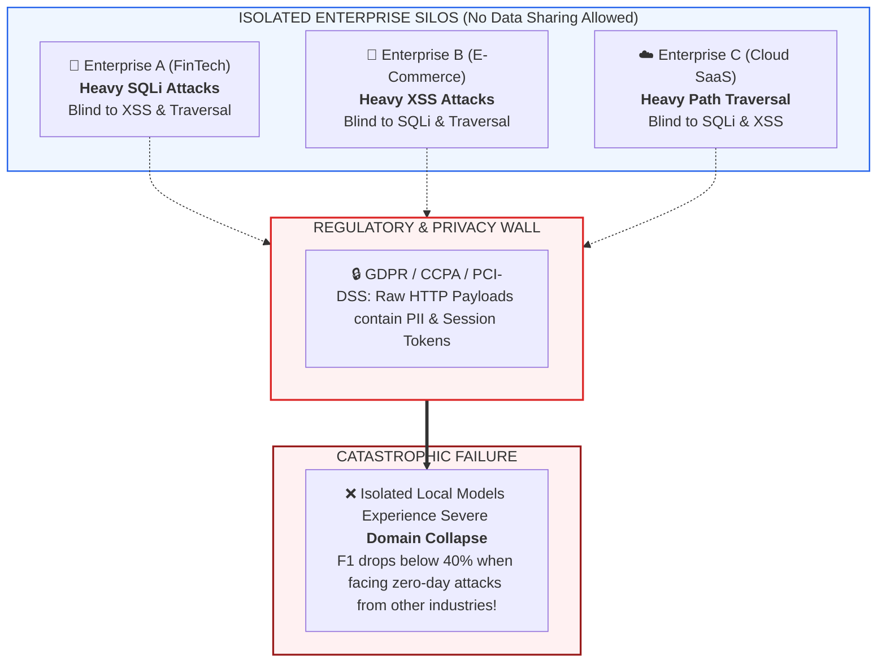

# 🛡️ Conference Presentation Slide Deck: Robust Federated Web Payload Detection
**Target Venue:** USENIX Security / IEEE Symposium on Security and Privacy (S&P) / ACM CCS Style  
**Format:** Modular Markdown Presentation (with Mermaid Visuals, Academic Figures & Verbatim Speaker Notes)

---

## 📑 Master Presentation Roadmap (25 Slides)

```mermaid
flowchart LR
    subgraph P1 ["PART I: MOTIVATION & GAPS"]
        S1["S1: Title"] --> S2["S2: Motivation"] --> S3["S3: Threat & Privacy"] --> S4["S4: Research Gap"]
    end
    subgraph P2 ["PART II: CORE CONTRIBUTION"]
        S4 --> S5["S5: Research Questions"] --> S6["S6: Visual Abstract"]
    end
    subgraph P3 ["PART III: DATA ENGINEERING"]
        S6 --> S7["S7: 5.3M Funnel"] --> S8["S8: Clean Room & CRS v4"] --> S9["S9: Zero-Leakage Split"] --> S10["S10: 6 Silo Non-IID"]
    end
    subgraph P4 ["PART IV: SYSTEM METHODOLOGY"]
        S10 --> S11["S11: Architecture"] --> S12["S12: W_base Anchor"] --> S13["S13: Silo Collapse 6x6"] --> S14["S14: FL Suite"] --> S15["S15: DAFL & Ensemble"]
    end
    subgraph P5 ["PART V: RESULTS & XAI"]
        S15 --> S16["S16: Baselines"] --> S17["S17: FL Master Table 4"] --> S18["S18: OOD Paradox"] --> S19["S19: Attention Maps"] --> S20["S20: SHAP & LIME"] --> S21["S21: Ablations"] --> S22["S22: Edge Latency"]
    end
    subgraph P6 ["PART VI: CONCLUSION & Q/A"]
        S22 --> S23["S23: Discussion"] --> S24["S24: Conclusion"] --> S25["S25: Future & Q/A"]
    end

    style P1 fill:#eff6ff,stroke:#2563eb,stroke-width:1.5px
    style P2 fill:#f5f3ff,stroke:#7c3aed,stroke-width:1.5px
    style P3 fill:#f0fdf4,stroke:#059669,stroke-width:1.5px
    style P4 fill:#fffbeb,stroke:#d97706,stroke-width:1.5px
    style P5 fill:#fef2f2,stroke:#dc2626,stroke-width:1.5px
    style P6 fill:#f8fafc,stroke:#475569,stroke-width:1.5px
```



---

<!-- SLIDE 01 -->
## 📍 Slide 01: Title Slide

### **Robust Federated Sequence Transformers for Web Attack Detection Under Extreme Non-IID Skew**

**Subtitle:** *Towards Zero-Shot Out-of-Domain Generalization via Dual-Anchor Optimization & Explainable AI*

---

#### 👤 Presenter & Affiliation
*   **Speaker:** Cybersecurity AI Research Team
*   **Affiliation:** Faculty of Information Technology, King Mongkut's University of Technology North Bangkok (KMUTNB)
*   **Session Track:** AI/ML in Cybersecurity & Collaborative Threat Intelligence

---

#### 💡 One-Line Thesis
> *"Federated sequence transformers anchored to a frozen foundation model solve enterprise data isolation while preventing out-of-domain generalization collapse in collaborative web defense."*

---

#### 📌 Key Presentation Meta
*   **Artifact DOI & Code:** [github.com/Cheesenoice/federated-web-payload-detection](https://github.com/Cheesenoice/federated-web-payload-detection)
*   **Audited Data Scale:** $2.79\text{ Million}$ Clean Payloads across $6$ Enterprise Non-IID Silos
*   **Evaluated Holdouts:** $354,808$ Global Network Test + $122,130$ External Zero-Shot OOD Benchmark (CSIC 2010)

```
========================================================================================
[SPEAKER NOTES]
"Good morning, session chairs, researchers, and attendees. 
Today, I am honored to present our work titled: 'Robust Federated Sequence Transformers 
for Web Attack Detection Under Extreme Non-IID Skew'.

In modern web security, every enterprise faces a critical dilemma: cyber attacks are 
evolving rapidly, yet privacy regulations prevent organizations from pooling raw payload 
logs together. In this presentation, we demonstrate how privacy-preserving federated 
learning, combined with character-level sequence transformers and foundation anchors, 
not only breaks this privacy barrier but also achieves superior generalization against 
unseen zero-day web attacks compared to traditional centralized learning. Let us begin."
========================================================================================
```

---

<!-- SLIDE 02 -->
## 📍 Slide 02: Motivation — The Multi-Enterprise Web Defense Dilemma

### Why Collaborative Web Attack Detection is Broken Today

---

### 🌐 The Threat Landscape in Numbers
*   **Massive Attack Volume:** Over **$80\text{ Billion}$** web application and API attacks recorded globally per year (Akamai State of the Internet).
*   **Core Attack Vectors:** **XSS (Cross-Site Scripting)**, **SQLi (SQL Injection)**, and **Path Traversal / LFI** constitute over **$78\%$** of all targeted application-layer breaches (OWASP Top 10).
*   **Heavy Obfuscation:** Modern evasions utilize multi-pass URL encoding, nested character escape codes, and whitespace manipulation to bypass signature-based WAFs.

---

### 🏢 The Multi-Enterprise Isolation Barrier



---

### 🎯 Core Problem Statement
1. **The Privacy Wall:** Enterpises **cannot legally or competitively share** raw payload traffic due to strict GDPR/PII constraints.
2. **The Non-IID Skew:** Different industries encounter completely different attack distributions (extreme class skew).
3. **The Result:** Local standalone models suffer from **Catastrophic Domain Forgetting**, leaving organizations defenseless against cross-domain evasion attacks.

```
========================================================================================
[SPEAKER NOTES]
"Let us look at why web attack defense is fundamentally broken across organizations today. 
Every enterprise operates in an isolated silo. A FinTech enterprise primarily observes 
complex SQL Injection attempts against its database backend. An E-Commerce platform 
encounters massive reflected and DOM-based Cross-Site Scripting attacks. A Cloud SaaS 
provider sees constant directory and Path Traversal probes.

Naturally, if these companies could combine their attack logs, they would build a supreme 
defense. However, this is legally impossible: HTTP requests contain sensitive user data, 
session cookies, and authentication tokens protected by GDPR and PCI-DSS regulations. 

Because of this privacy wall, every company trains isolated local models. In our empirical 
experiments, we found that these isolated models fail catastrophically—their detection 
F1-score drops below 40% when exposed to attack families from outside their industry. 
This brings us to our research gap."
========================================================================================
```

---
