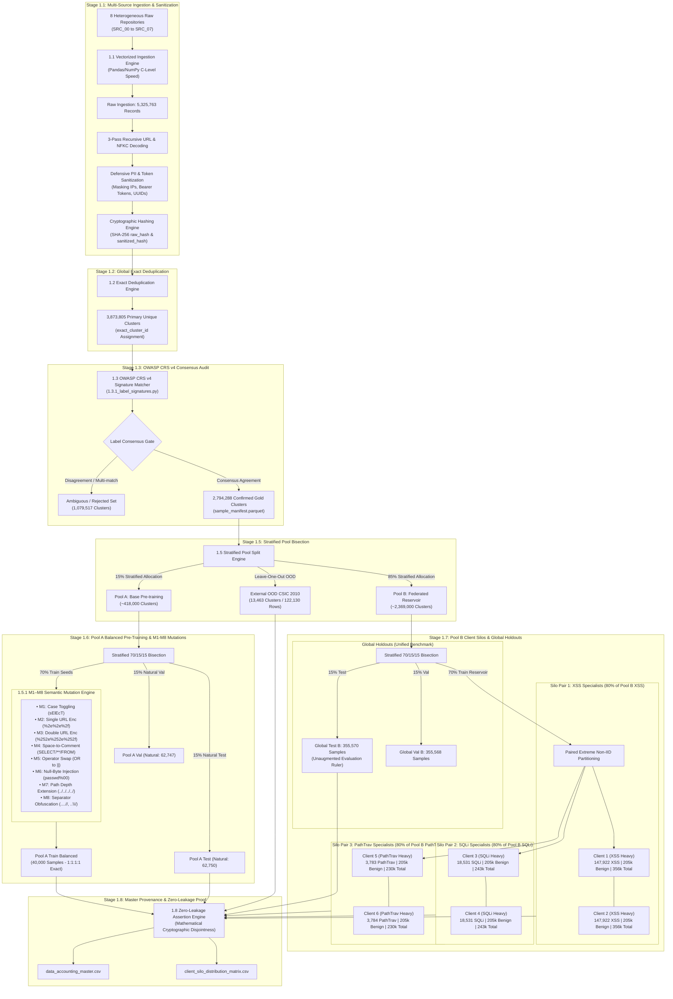

# 🛡️ Stage 1: Data Foundation (Clean Room & Provenance Architecture)

## 📌 Executive Summary
Stage 1 establishes the **Data Clean Room** for the Federated Web Payload project. Operating across 8 heterogeneous cybersecurity data repositories containing over **5.32 million raw records**, this stage transforms raw, noisy HTTP traffic into cryptographically disjoint, lineage-verified datasets.

The pipeline achieves:
1. **100% Provenance Tracking:** Complete audit trail from raw bytes to train/test partitions.
2. **Zero-Leakage Guarantee:** Cryptographic SHA-256 deduplication and strict disjointness assertions preventing train-test contamination.
3. **OWASP CRS v4 Consensus Gate:** Rule-based verification against Web Application Firewall (WAF) standards to eliminate noisy public annotations without circular AI dependencies.
4. **Two-Tier Architecture:** 
   - **Pool A (15%):** Pre-training foundation balanced to exact **1:1:1:1** (40,000 samples) via **M1–M8 Semantic Mutations**.
   - **Pool B (85%):** Natural distribution federated reservoir partitioned into **Global Holdouts (30%)** and **6 Extreme Non-IID Client Silos (70%)**.
5. **Independent Out-of-Domain Holdout:** **CSIC 2010 (122,130 records)** completely isolated for zero-shot generalized evaluation.

---

## 🏗️ End-to-End Pipeline Architecture (Mermaid Diagram)

---

## 📂 Modular Script Breakdown

| Script File | Purpose | Key Inputs | Output Artifacts |
| :--- | :--- | :--- | :--- |
| **`1.1_data_ingest_and_hash.py`** | Vectorized multi-source ingestion, 3-pass decoding, defensive masking (IPs, tokens, UUIDs), and SHA-256 hashing. | `data/raw/SRC_00` to `SRC_07` | `data/interim/manifest_stage1.parquet` (5,325,763 rows) |
| **`1.2_global_dedup_and_cluster.py`** | Exact cluster deduplication based on `sanitized_hash`. Flags primary representatives (`is_primary_in_cluster`). | `data/interim/manifest_stage1.parquet` | `data/interim/manifest_stage2.parquet` (3,873,805 clusters) |
| **`1.3_label_consensus_audit.py`** | Audits primary clusters against OWASP CRS v4 regex engine. Establishes `confirmed`, `ambiguous`, and `rejected` labels. | `data/interim/manifest_stage2.parquet` | `data/processed/sample_manifest.parquet` (2,794,288 confirmed clusters) |
| **`1.3.1_label_signatures.py`** | The OWASP CRS v4 regex matching rules (Rules 941 XSS, 942 SQLi, 930 PathTrave) with D19 scrubbing. | Function calls | Signature verification module |
| **`1.4_generate_accounting_report.py`** | Computes per-source data balance matrix and ingestion funnel statistics. | `data/processed/sample_manifest.parquet` | `data/processed/data_accounting.csv` `data/processed/source_label_accounting.csv` |
| **`1.5_pool_split.py`** | Stratified bisection of confirmed data into **Pool A (15%)**, **Pool B (85%)**, and **OOD (CSIC 2010)**. | `data/processed/sample_manifest.parquet` | Updated `sample_manifest.parquet` (with `pool_id`) |
| **`1.5.1_m1_m8_augment.py`** | Deterministic semantic mutation engine implementing rules M1–M8 while strictly preserving parent cluster lineage. | Function calls | Mutation variant generator |
| **`1.6_build_pool_a_balanced.py`** | Generates the 1:1:1:1 balanced pretraining corpus (40,000 samples) for Pool A Train, while preserving natural Val/Test. | `sample_manifest.parquet` | `pool_a_train_balanced_40k.parquet` `pool_a_val.parquet` `pool_a_test.parquet` |
| **`1.7_partition_pool_b_clients.py`** | Carves out Global Test/Val holdouts (30%) and partitions Train B (70%) into 6 Extreme Non-IID Client Silos. | `sample_manifest.parquet` | `pool_b_global_test.parquet` `pool_b_global_val.parquet` `clients/client_{1..6}_{train,val,test}.parquet` |
| **`1.8_master_accounting_report.py`** | Executes mathematical Zero-Leakage assertions and generates master accounting matrices. | All processed parquet files | `data/processed/data_accounting_master.csv` `data/processed/client_silo_distribution_matrix.csv` |

---

## 📊 Summary Statistics & Provenance Ledger

### 1. 6-Client Non-IID Silo Distribution Matrix (`client_silo_distribution_matrix.csv`)

| Client ID | Specialization | Total Samples | Train (80%) | Val (10%) | Test (10%) | Benign | XSS | SQLi | PathTrav |
| :--- | :--- | :---: | :---: | :---: | :---: | :---: | :---: | :---: | :---: |
| **Client 1** | 🔴 **XSS Heavy** | 356,331 | 285,062 | 35,633 | 35,636 | 205,029 | **147,922** | 2,316 | 472 |
| **Client 2** | 🔴 **XSS Heavy** | 356,332 | 285,063 | 35,633 | 35,636 | 205,029 | **147,922** | 2,316 | 473 |
| **Client 3** | 🟠 **SQLi Heavy** | 243,115 | 194,490 | 24,311 | 24,314 | 205,029 | 18,490 | **18,531** | 473 |
| **Client 4** | 🟠 **SQLi Heavy** | 243,115 | 194,490 | 24,311 | 24,314 | 205,029 | 18,490 | **18,531** | 473 |
| **Client 5** | 🟣 **PathTrav Heavy** | 230,210 | 184,166 | 23,021 | 23,023 | 205,029 | 18,490 | 2,316 | **3,783** |
| **Client 6** | 🟣 **PathTrav Heavy** | 230,214 | 184,169 | 23,021 | 23,024 | 205,029 | 18,491 | 2,317 | **3,784** |

### 2. Master Dataset Provenance Table (`data_accounting_master.csv`)

| Category | Dataset Name | Total Records | Benign | XSS | SQLi | PathTrav | Other | Description |
| :--- | :--- | :---: | :---: | :---: | :---: | :---: | :---: | :--- |
| **Data Clean Room** | Raw Manifest | **5,325,763** | 3,952,051 | 724,768 | 369,905 | 237,837 | 41,202 | Unified raw ingestion across 8 sources |
| **Data Clean Room** | Primary Unique Clusters | **3,873,805** | 2,791,144 | 675,568 | 169,713 | 197,908 | 39,472 | Post-Deduplication canonical clusters |
| **Data Clean Room** | OWASP Confirmed Clusters | **2,794,288** | 2,072,352 | 621,997 | 78,005 | 15,963 | 5,971 | **Gold Consensus Set (100% Pure)** |
| **Pool A (Pretrain)** | **Pool A Train Balanced** | **40,000** | **10,000** | **10,000** | **10,000** | **10,000** | 0 | **1:1:1:1 Pretraining Corpus (M1-M8)** |
| **Pool A (Pretrain)** | Pool A Natural Val | 62,747 | 46,519 | 13,984 | 1,752 | 358 | 134 | Base Validation (Unaugmented) |
| **Pool A (Pretrain)** | Pool A Natural Test | 62,750 | 46,520 | 13,985 | 1,752 | 358 | 135 | Base In-Domain Test (Unaugmented) |
| **Pool B (Holdout)** | **Pool B Global Test** | **355,570** | 263,609 | 79,244 | 9,928 | 2,027 | 762 | **Unified FL Evaluation Benchmark** |
| **Pool B (Holdout)** | Pool B Global Val | 355,568 | 263,609 | 79,244 | 9,927 | 2,027 | 761 | Global Validation Benchmark |
| **External Benchmark**| **OOD CSIC 2010 Test** | **122,130** | 120,048 | 1,504 | 384 | 194 | 0 | External Out-of-Domain Generalization |

---

## 🔬 Mathematical Zero-Leakage Proof
All generated datasets are verified via strict set-disjointness assertions in `1.8_master_accounting_report.py`:
$$\text{Pool A} \cap \text{Pool B} = \emptyset$$
$$\text{Train}_{\text{Client } i} \cap \text{Train}_{\text{Client } j} = \emptyset \quad \forall i \neq j$$
$$\text{Train}_{\text{Client } i} \cap \text{Test}_{\text{Global B}} = \emptyset \quad \forall i$$
$$\text{Train}_{\text{Pool A}} \cap \text{Test}_{\text{Pool A}} = \emptyset$$
$$\text{Pool A} \cap \text{OOD}_{\text{CSIC}} = \emptyset, \quad \text{Pool B} \cap \text{OOD}_{\text{CSIC}} = \emptyset$$
